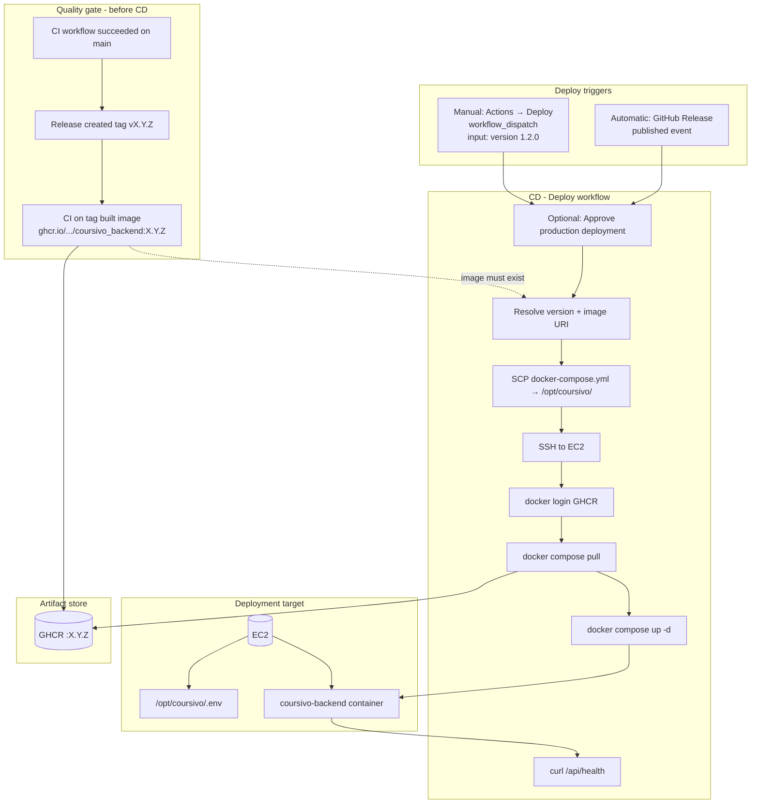

# Coursivo CI/CD — Learning Guide

Use this doc when you sit down to **build, configure, or practice** the pipeline. It matches the CD diagram and the files in this repo.

**Related docs:** [DEPLOYMENT.md](./DEPLOYMENT.md) (EC2 + secrets + approval), [RELEASING.md](./RELEASING.md) (older manual-tag notes — prefer this guide for current flow).

---

## 1. Big picture (three workflows)

```text
┌─────────────────────────────────────────────────────────────────────────┐
│  ON EVERY PR / PUSH TO main                                             │
│  ci.yml  →  format, checkstyle, build JAR, push Docker (latest + sha)   │
└─────────────────────────────────────────────────────────────────────────┘
                                    │
                                    ▼ (push to main only, CI success)
┌─────────────────────────────────────────────────────────────────────────┐
│  release.yml  →  semantic-release  →  tag vX.Y.Z + GitHub Release       │
└─────────────────────────────────────────────────────────────────────────┘
                                    │
                                    ▼ (tag push triggers CI again)
┌─────────────────────────────────────────────────────────────────────────┐
│  ci.yml on tag  →  stamp pom version, build, push ghcr.io:...:X.Y.Z     │
└─────────────────────────────────────────────────────────────────────────┘
                                    │
                                    ▼ (Release published OR manual Deploy)
┌─────────────────────────────────────────────────────────────────────────┐
│  deploy.yml  →  [APPROVAL if production reviewers enabled]  →  EC2      │
└─────────────────────────────────────────────────────────────────────────┘
```

**Deploy on release + manual approval:** `deploy.yml` already uses `environment: production`. You only configure reviewers in GitHub (see [§ 8](#8-manual-approval-before-production-deploy)).

---

## 2. CD diagram (what to understand)

Copy this into any Mermaid viewer if you want the picture.



### Box-by-box checklist

Study each row until you can explain it without opening the YAML.

| # | Box | Question you should answer | Where to look |
|---|-----|---------------------------|---------------|
| 1 | **CI_OK** | What runs on PR vs push to `main`? What is skipped? | `.github/workflows/ci.yml` |
| 2 | **REL** | Who creates `v1.2.0`? Does it commit to `main`? | `release.yml`, `.releaserc.json` |
| 3 | **BUILD** | Why does CI run again after the tag? What image tags appear? | `ci.yml` (tag push, metadata-action) |
| 4 | **GHCR** | Image name, public/private, who can pull? | GitHub → Packages |
| 5 | **AUTO** | What event starts Deploy? | `deploy.yml` → `release: published` |
| 6 | **MAN** | How do you deploy `1.1.0` without a new release? | Actions → Deploy → Run workflow |
| 7 | **APPROVE** | Where do you click Approve? | Settings → Environments → `production` |
| 8 | **RESOLVE** | How does `v1.2.0` become `ghcr.io/owner/repo:1.2.0`? | `deploy.yml` “Resolve version” step |
| 9 | **SCP / SSH** | What files land on EC2? Which secrets? | `deploy.yml`, `deploy/docker-compose.yml` |
| 10 | **LOGIN / PULL / UP** | What is in `.env` vs GitHub secrets? | `deploy/.env.example`, server `/opt/coursivo/.env` |
| 11 | **HC** | What if DB or JWT is wrong? | Deploy logs, Neon allowlist |
| 12 | **EC2 / CTR** | One container, which port, where is Postgres? | `DEPLOYMENT.md` |

---

## 3. What exists in the repo (inventory)

| Path | Role |
|------|------|
| `.github/workflows/ci.yml` | CI: build, quality checks, Docker push, JAR artifact |
| `.github/workflows/release.yml` | After CI on `main` succeeds → semantic-release |
| `.github/workflows/deploy.yml` | CD: deploy image to EC2 (release + manual) |
| `.releaserc.json` | semantic-release rules (conventional commits → version) |
| `package.json` / `package-lock.json` | Node deps **only** for semantic-release in Actions |
| `Dockerfile` | How the app is packaged into an image |
| `deploy/docker-compose.yml` | Runtime on EC2 (`IMAGE` env, ports, health) |
| `deploy/.env.example` | Template for server-side secrets (not committed filled-in) |
| `deploy/ec2-bootstrap.sh` | One-time Docker install on Ubuntu |
| `docs/DEPLOYMENT.md` | EC2 setup, secrets, deploy, rollback, approval |
| `docs/CICD-LEARNING-GUIDE.md` | This file |

---

## 4. What CI used to be vs what CI is now

### Earlier / simpler CI (conceptual)

| Aspect | Before (typical starter) |
|--------|---------------------------|
| Trigger | Push to `main`, maybe manual tag |
| Release | Manual `git tag v1.0.0` + manual GitHub Release |
| Version in `pom.xml` | You bumped by hand |
| Docker tags | Maybe only on manual tag |
| Deploy | None in GitHub Actions |
| Gate before prod | None |

### Current CI + release + CD

| Aspect | Now |
|--------|-----|
| **CI** (`ci.yml`) | Every PR + push to `main`; tag pushes `v*.*.*` |
| Quality | Spring Java Format, Checkstyle, `mvn package` (tests skipped for now) |
| Artifacts | JAR uploaded on `main`/tag; Docker pushed to **GHCR** |
| **`main` images** | `latest`, git SHA, semver minors from metadata |
| **Tag images** | Exact `X.Y.Z`, plus `X.Y`, `X` |
| **Release** (`release.yml`) | Runs after **successful CI on `main`**; semantic-release creates tag + GitHub Release (no commit back to `main` for version) |
| **Version on tag build** | `versions-maven-plugin` stamps `pom.xml` from tag in CI only |
| **CD** (`deploy.yml`) | On Release published or manual version; optional **production approval** |

### What did *not* change in spirit

- You still need a **green build** before you trust an artifact.
- Production still means **a specific version** on a **server**, not “whatever was last on `main`” unless you deploy `latest` on purpose (we deploy **semver tags**).

---

## 5. CI workflow (`ci.yml`) — step by step

| Step | What it does | Learn |
|------|----------------|-------|
| Triggers | PR + push `main`/`master` + semver tags | Branch vs tag pipelines |
| `if` on job | Skip `[skip ci]` commits on `main`; always run PRs and tags | Avoid infinite release loops |
| Checkout | Clone repo | — |
| Resolve release version | Tag push → `is_release=true`, version from tag | Tags drive immutable releases |
| JDK 21 + Maven cache | Toolchain | Reproducible builds |
| Stamp pom (tag only) | Set `pom.xml` version to match tag | Build matches release number |
| Spring Java Format | Code style gate | Fail fast on format |
| Checkstyle | Static style rules | Same |
| `mvn package -DskipTests` | Produces JAR | **TODO:** turn tests on later |
| Upload JAR | Artifact for debugging; Release attaches JAR on tag | Artifacts vs container |
| Docker login | `GITHUB_TOKEN` → GHCR | Registry auth |
| metadata-action | Computes image tags | Semver + `latest` + sha |
| build-push-action | Build `Dockerfile`, push if push event | Image = deployable unit |
| Attach JAR to Release | Tag builds only | Release assets |

**Commits on `main`:** image gets `latest` and SHA — good for experiments, **not** what production deploy uses by default.

**After semantic-release:** tag `v1.2.0` → CI runs again → image `ghcr.io/<owner>/coursivo_backend:1.2.0` — **this** is what Deploy pulls.

---

## 6. Release workflow (`release.yml`) — step by step

| Step | What it does | Learn |
|------|----------------|-------|
| `workflow_run` after CI | Release **never** races with a failed CI on same commit | Quality gate |
| `if` success + push + `main` | No release from failed or PR CI | — |
| `npm ci` + semantic-release | Reads conventional commits since last tag | `feat:` → minor, `fix:` → patch, `!` or `BREAKING CHANGE` → major |
| `@semantic-release/github` | Creates tag `vX.Y.Z` + GitHub Release | Tag push triggers CI again |

**Not used (on purpose):** `@semantic-release/git` committing version bumps to `main` (protected branch / extra CI loops).

**Config:** `.releaserc.json`, `package.json`.

---

## 7. Deploy workflow (`deploy.yml`) — step by step

| Step | What it does | Learn |
|------|----------------|-------|
| `release: published` | Auto-deploy when Release goes live | CD trigger |
| `workflow_dispatch` | Manual version input | Rollback / hotfix deploy |
| `environment: production` | Secrets + **approval gate** if configured | Human gate before SSH |
| Resolve version | Strip `v`, build `ghcr.io/.../repo:version` | Image URI contract |
| SCP compose file | Updates `/opt/coursivo/docker-compose.yml` | Infra as file on server |
| SSH script | login → pull → up → health loop | Real CD commands |
| `concurrency: deploy-production` | No overlapping deploys | Safer prod |

**Server must already have:** Docker, `/opt/coursivo/.env`, Neon allowlist — see `DEPLOYMENT.md`.

---

## 8. Manual approval before production deploy

**You want:** deploy on release, but **you** click approve before SSH.

**Do this once in GitHub (no code change required):**

1. **Settings → Environments → New environment** → name: `production`
2. Check **Required reviewers** → add your GitHub user
3. Save

**Then:**

- Semantic-release publishes a Release → **Deploy** workflow starts → status **Waiting for review**
- Open the run → **Review deployments** → **Approve and deploy**
- Same for **Actions → Deploy → Run workflow**

Release and GHCR image build are **not** waiting on you—only the Deploy job.

---

## 9. What to learn (concepts, not code)

Work through in order; check off as you go.

### Tier A — Must understand for this repo

- [ ] Difference between **CI** (prove build) and **CD** (run it on EC2)
- [ ] **Immutable tag** `1.2.0` vs moving tag `latest`
- [ ] **GHCR** as container registry; PAT for pull on EC2
- [ ] **semantic-release** and conventional commits
- [ ] Why CI runs **twice** (push `main`, then push tag)
- [ ] GitHub **Environments** and approval
- [ ] **Rollback** = run Deploy with older version

### Tier B — Deepen when comfortable

- [ ] `docker compose` vs raw `docker run`
- [ ] Secrets: GitHub vs `.env` on server
- [ ] Security group / binding `127.0.0.1:8080`
- [ ] Neon IP allowlist and JDBC URL
- [ ] `workflow_run` vs `push` triggers

### Tier C — Later (AWS / Jenkins practice)

- [ ] CodePipeline / CodeBuild / CodeDeploy vs this setup
- [ ] Jenkins → S3 → CodeDeploy (work pattern)
- [ ] ECS / ALB when you outgrow one EC2

---

## 10. What to code / configure (tomorrow’s build checklist)

Do in this order. Don’t skip secrets on EC2.

### Phase 0 — GitHub (no EC2 yet)

- [ ] Read `ci.yml`, `release.yml`, `deploy.yml` once end-to-end
- [ ] Confirm `package-lock.json` exists; `npm ci` works locally if curious
- [ ] Create environment **`production`** + **required reviewers**
- [ ] Add repo secrets: `EC2_HOST`, `EC2_USER`, `EC2_SSH_KEY`, `GHCR_PAT` (when EC2 exists)

### Phase 1 — CI only (no deploy)

- [ ] Open a PR → watch CI (format, checkstyle, build)
- [ ] Merge to `main` → CI passes → Release workflow → new tag (if commits warrant it)
- [ ] Confirm package on GHCR has version tag after tag build

### Phase 2 — EC2 one-time

- [ ] Launch Ubuntu EC2, security group, optional Elastic IP
- [ ] Run `deploy/ec2-bootstrap.sh`
- [ ] Copy `deploy/.env.example` → `/opt/coursivo/.env`, fill DB/JWT/SendGrid
- [ ] Neon: allow EC2 IP

### Phase 3 — First CD

- [ ] Wait for GitHub Release + CI on tag (image `:X.Y.Z` exists)
- [ ] Deploy workflow starts → **approve** production
- [ ] Verify: `curl` health, `docker ps` on EC2
- [ ] Rollback drill: Deploy previous version, approve again

### Phase 4 — Hardening (when ready)

- [ ] Enable tests in CI (remove `-DskipTests`)
- [ ] Branch protection: require CI on `main`
- [ ] ALB + HTTPS (optional)
- [ ] Update outdated `docs/RELEASING.md` if you drop manual tags entirely

**You do not need to code** new workflows for approval—only GitHub Environment settings.

---

## 11. One full practice run (script)

```text
Day 1
  1. feat: something → PR → CI green → merge main
  2. CI on main → Release → tag v0.x.y (if analyzer says so)
  3. CI on tag → GHCR :0.x.y
  4. Deploy triggered by Release → Approve → health OK

Day 2
  5. fix: something → repeat → new tag
  6. Approve deploy → confirm new version on EC2
  7. Deploy workflow_dispatch with OLD version → rollback

Teardown (save money)
  8. Terminate EC2, release Elastic IP, pause/delete Neon if not needed
```

---

## 12. Troubleshooting quick reference

| Symptom | Likely cause |
|---------|----------------|
| Deploy never starts | Release not published; workflow disabled; wrong branch |
| Stuck “Waiting” | Approve under Actions → Deploy run |
| `docker pull` 401 | `GHCR_PAT`, private package permissions |
| Health check fail | `.env`, Neon IP, app logs |
| Deploy wrong version | Check input / release tag_name vs image on EC2 |
| No new version tag | Commits didn’t trigger semver (docs-only might still patch per config) |

---

## 13. Learning path after this repo

```text
Now     →  Master this guide + DEPLOYMENT.md + one live deploy
Later   →  AWS CodePipeline / CodeBuild / CodeDeploy on a throwaway EC2
Later   →  Jenkins CI/CD lab (closer to work)
```

Same ideas: **build → store artifact → promote version → health check**.

---

## Summary

| Question | Answer |
|----------|--------|
| Deploy on release? | Yes — `release: published` in `deploy.yml` |
| Manual approval? | Yes — enable **Required reviewers** on environment `production` |
| What to read tomorrow? | This file §10 checklist + the three workflow YAML files |
| What to code first? | EC2 + secrets + approval; workflows are already in repo |
